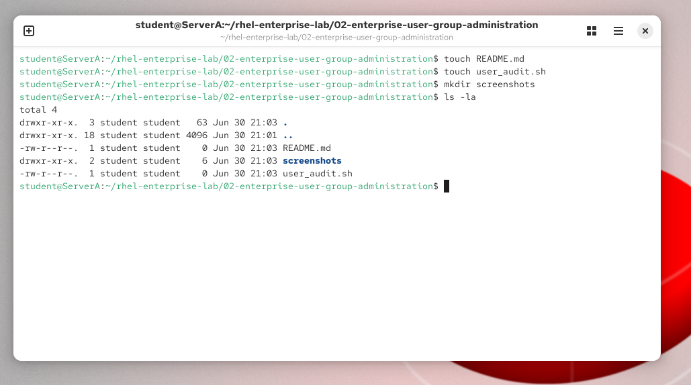
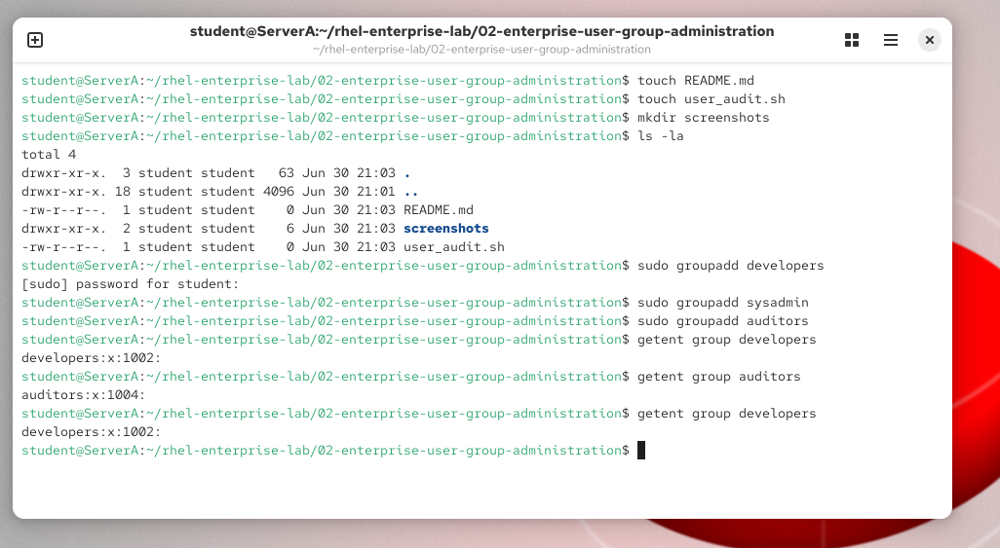
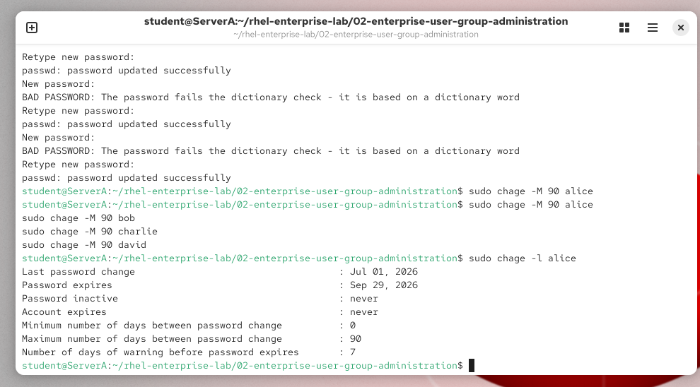
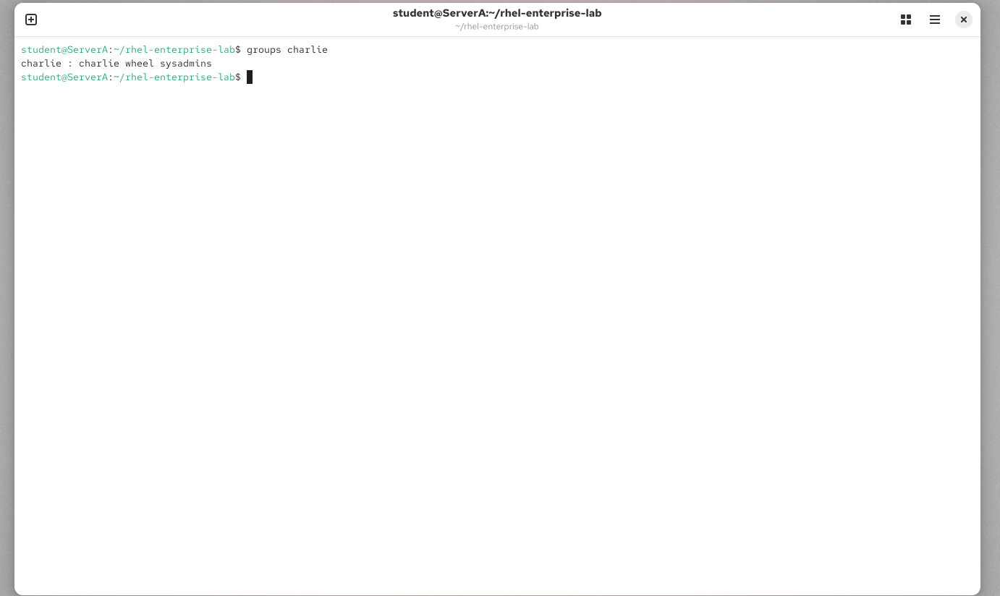
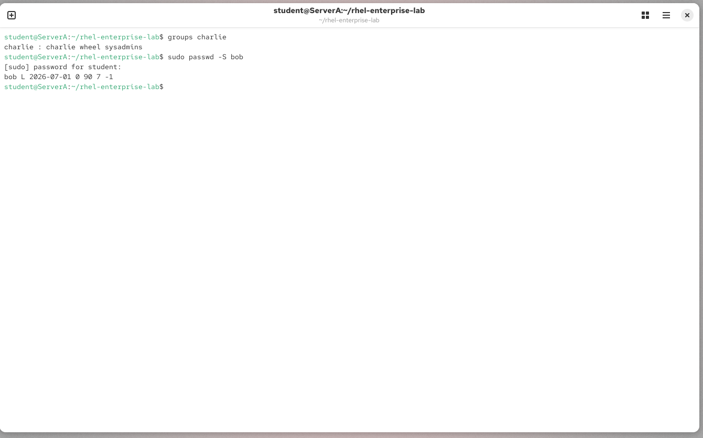
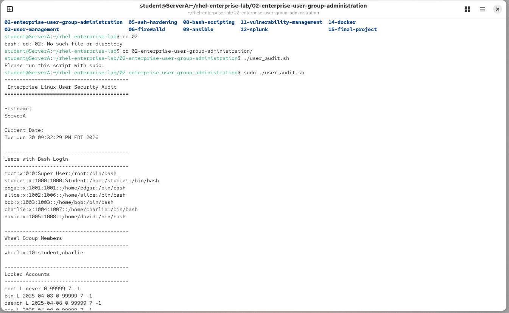

# Lab 02 - Enterprise User & Group Administration

## Objective

Configure a Red Hat Enterprise Linux server for a new development team while following enterprise security best practices.

---

## Skills Demonstrated

- Linux user administration
- Group management
- Password management
- Password aging policies
- Sudo administration
- User account locking
- Bash scripting
- Security auditing

---

## Tasks Performed

- Created enterprise security groups
- Added users to appropriate groups
- Assigned passwords
- Configured password expiration (90 days)
- Granted administrative privileges to authorized users
- Locked a user account
- Developed a Bash security audit script

---

## Commands Used

- groupadd
- useradd
- passwd
- chage
- usermod
- getent
- awk
- grep
- chmod

---

## Files

- user_audit.sh
- screenshots/

---

## Lessons Learned

This lab demonstrated how Linux administrators manage enterprise user accounts, enforce password policies, implement least privilege, and automate security auditing using Bash scripting.

---

## Security Concepts

- Principle of Least Privilege
- Administrative Separation
- Password Aging
- Account Locking
- User Auditing

## Screenshots

### Lab Structure

### Creating Enterprise Groups

### Password Aging Policy

### Administrative Access (Wheel Group)

### Locked User Account

### Enterprise User Audit Script

